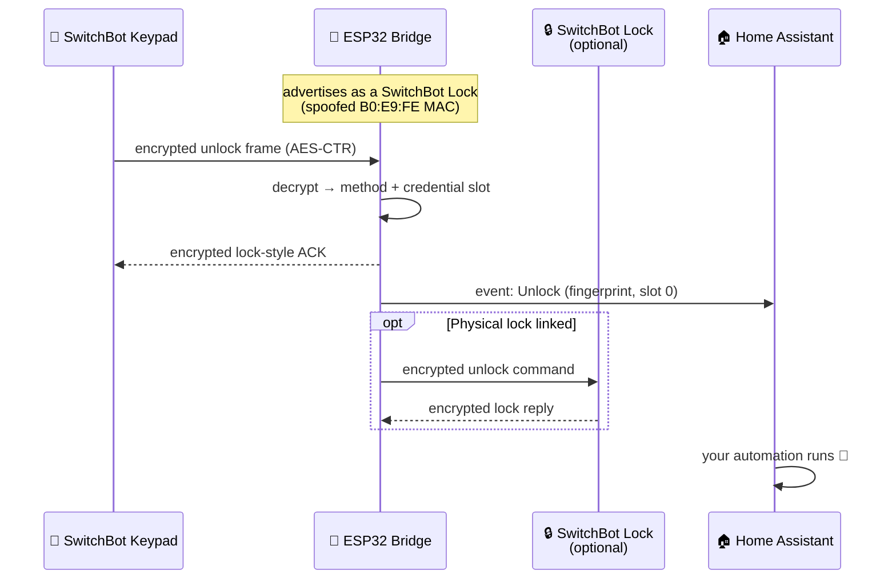

<div align="center">

# 🔐 SwitchBot Keypad Bridge

**Use a SwitchBot Keypad locally, with or without a SwitchBot Lock.**

An ESP32 that impersonates a SwitchBot Lock over Bluetooth LE. A genuine keypad
links to it, and every PIN, fingerprint, NFC tag and face unlock becomes a
Home Assistant event — or, optionally, gets relayed to a real SwitchBot Lock
through the bridge. The keypad still thinks it is talking to a lock; you decide
whether that lock is virtual, physical, or both.

[](https://esphome.io/)
[](https://www.espressif.com/)
[](https://www.home-assistant.io/)
[](https://buymeacoffee.com/pierluigizagaria)


*The on-device setup wizard — no Python scripts, no BLE sniffing, no laptop.*

</div>

---

## ✨ Highlights

- 🔓 **No SwitchBot Lock required** — repurpose a keypad as a standalone, fully
  local door/access controller.
- 🔒 **Optional physical lock relay** — link a real SwitchBot Lock in the same
  wizard and the bridge forwards keypad protocol messages over encrypted BLE.
- 📟 **Every SwitchBot keypad works** — Keypad, Keypad Touch, Keypad Vision and
  Vision Pro: that's the whole lineup. Touch and Vision are tested on real
  hardware; the other two speak the exact same protocols.
- 📲 **On-device setup wizard** — the ESP32 serves a small web page: sign in to
  your SwitchBot account, pick the keypad, optionally link the lock, done.
- 👤 **Knows who unlocked** — every unlock carries the method (`pin` /
  `fingerprint` / `nfc` / `face`) and the credential slot, so you can act per user.
- 🔔 **Doorbell, no lock needed** — on Keypad Vision the doorbell button is
  enabled automatically during setup (the app normally hides it until a lock
  is bound) and each press fires its own Home Assistant event.
- 🔋 **Battery monitoring** — keypad and linked-lock battery levels, exposed
  as diagnostic sensors.
- 🔐 **Key material stays off YAML** — the keypad session key is generated on
  the ESP32; optional lock relay keys are fetched during setup and stored in
  NVS, never in your YAML or git.
- 🏠 **100% local after setup** — the cloud is contacted only by the wizard
  while setup runs. Day-to-day operation is pure BLE + ESPHome, no cloud
  round-trips.

## 🧠 How it works

A SwitchBot Keypad is not a dumb button matrix: it encrypts every command with
AES-CTR and only talks to a device that advertises like a SwitchBot Lock,
answers the lock GATT protocol, **and** carries a `B0:E9:FE` SwitchBot MAC.
The bridge plays that part end to end:



**Setup** is the only step that touches the cloud. The keypad ships encrypted
with a *communication key* that lives on SwitchBot's servers, not in the app, so
the wizard signs in to your account, fetches that key over HTTPS, re-encrypts
the pairing handshake, and injects a fresh AES-128 session key generated on the
ESP32. If you link a physical lock, the wizard uses the lock communication key
once, only in RAM, to install that same shared key into the lock, then verifies
the shared-key slot. From that moment, keypad events and optional lock relay
are local.

Curious about the details — MAC spoofing, NimBLE, key rotation? See
[Under the hood](#-under-the-hood).

## 🚀 Quick start

**You need:** an ESP32 and a SwitchBot Keypad already added to your SwitchBot
account. To enable physical relay, add a SwitchBot Lock to the same account and
keep it near the ESP32 during setup.

### 1. Create `secrets.yaml`

Copy `secrets.example.yaml` to `secrets.yaml` and fill in your details:

```yaml
wifi_ssid: "your_network_name"
wifi_password: "your_wifi_password"
ota_password: "a_strong_ota_password"
```

### 2. Flash the ESP32

```bash
pip install esphome
esphome run switchbot-keypad-bridge.yaml
```

### 3. Link the keypad

On first boot — with no keypad linked — the device opens its **setup wizard**
automatically. Open it in a browser at `http://<device-ip>/` (the IP is in the
boot log, or use Home Assistant's **Visit Device** link on the device page):

1. Sign in with your SwitchBot account.
2. Pick your keypad from the list.
3. Wait for the wizard to finish.

> The wizard recognises the keypad from its live BLE advertisement, so keep it
> powered and within ~2 m of the ESP32 — out-of-range devices won't be listed.

At this point the keypad's name appears on the **Keypad** sensor and key
presses arrive in Home Assistant as `Lock` / `Unlock` / `Doorbell` events.

### 4. Optional: link a physical lock

After keypad linking, the wizard unlocks the **Lock** tab. Pick a supported
SwitchBot Lock from the list and wait for the link job to verify the encrypted
BLE key. When it succeeds, the **Lock** sensor shows the linked lock name and
keypad protocol messages are forwarded to that physical lock by default.

Standalone mode still works with no linked lock: the bridge acknowledges the
keypad locally and keeps publishing Home Assistant events.

> **Re-linking** — to switch to a different keypad or lock, press the **Reset**
> button in Home Assistant. The device forgets the current keypad and lock,
> rotates its session key, and re-opens the setup wizard right away — no reboot.

To stream logs at any time:

```bash
esphome logs switchbot-keypad-bridge.yaml
```

## 👤 Knowing who unlocked the door

Every `on_unlock` trigger carries two values:

| Parameter | Type | Values |
|---|---|---|
| `method` | `std::string` | `"pin"`, `"fingerprint"`, `"nfc"`, `"face"`, or `"unknown"` |
| `index` | `int` | Numeric ID of the credential slot |

`index` is the slot the SwitchBot app assigns when you add a credential — first
one gets `0`, the next `1`, and so on. Combined with `method`, it tells you
exactly who is at the door.

The cleanest pattern: forward both values to Home Assistant as a custom event
and build per-user automations there, without recompiling the firmware:

```yaml
switchbot_keypad_bridge:
  on_unlock:
    - homeassistant.event:
        event: esphome.switchbot_keypad_unlock
        data:
          method: !lambda 'return method;'
          index: !lambda 'return to_string(index);'
```

Then in Home Assistant, one automation per credential:

```yaml
alias: Welcome home — owner fingerprint
triggers:
  - trigger: event
    event_type: esphome.switchbot_keypad_unlock
conditions:
  - condition: template
    value_template: >
      {{ trigger.event.data.method == 'fingerprint' and
         trigger.event.data.index == '0' }}
actions:
  - action: notify.mobile_app
    data:
      message: Welcome home!
```

## 🔒 Physical lock relay

If you also own a SwitchBot Lock, the bridge can stay in the middle instead of
being only a virtual lock. The setup wizard lists supported locks from the same
SwitchBot account, checks that the selected lock is nearby, provisions the
bridge's shared keypad/lock key into the lock, and verifies that shared slot
before saving it.

With a linked lock, side-effecting keypad command payloads are mirrored to the
physical lock. Home Assistant events and the keypad response are local and
immediate, so your automations keep seeing the same keypad actions while the
lock relay runs in the background.

The physical lock's encrypted reply is used only to log the relay outcome; it
is not forwarded back to the keypad. If the BLE exchange fails, the keypad has
already received its local lock-style response and the failure is reported in
the ESPHome logs.

```yaml
switchbot_keypad_bridge:
  linked_lock:
    name: "Lock"
```

Supported lock families: Lock, Lock Lite, Lock Pro, Lock Pro Wi-Fi, Lock Ultra,
Lock Vision and Lock Vision Pro. Keep the lock near the ESP32 during setup; the
wizard only enables linking for locks it can see over BLE.

## 🔔 Doorbell (Keypad Vision)

The official app hides the doorbell button until a SwitchBot Lock is bound to
your account, so the bridge enables it automatically at the end of keypad setup.
Each press fires the `on_doorbell` trigger and a `Doorbell` event:

```yaml
switchbot_keypad_bridge:
  on_doorbell:
    - homeassistant.event:
        event: esphome.switchbot_keypad_doorbell
```

> Vision family only — Original / Touch keypads have no doorbell button.

## 🔋 Battery sensors

The keypad and linked physical lock broadcast their battery levels in BLE
advertisements. Add either sensor and the bridge picks it up with a short
shared background scan (every 15 minutes by default). If a lock advert does
not include battery data, the value is left unchanged and retried at the next
scan interval:

```yaml
switchbot_keypad_bridge:
  keypad_battery_level:
    name: "Keypad Battery"
  lock_battery_level:
    name: "Lock Battery"
  battery_scan_interval: 15min
```

## ⚙️ Configuration reference

| Option | Type | Required | Description |
|---|---|---|---|
| `keypad_action` | event | no | Standard ESPHome `event` entity for keypad actions. Surfaces in HA as `event.<device>_action` with `Lock` / `Unlock` / `Doorbell` event types. |
| `keypad` | text_sensor | no | Diagnostic text sensor whose state is the linked keypad name, or `Unlinked` when no keypad is linked. |
| `linked_lock` | text_sensor | no | Diagnostic text sensor whose state is the linked physical lock name, or `Unlinked` when relay mode is inactive. |
| `keypad_battery_level` | sensor | no | Battery percentage of the linked keypad, read from its BLE advertisement (Diagnostic category). |
| `lock_battery_level` | sensor | no | Battery percentage of the linked physical lock, read from its BLE advertisement (Diagnostic category). |
| `battery_scan_interval` | time | no | How often the bridge refreshes keypad and lock battery sensors with the shared advertisement scan. Default `15min`. |
| `reset_button` | button | no | Button that forgets the linked keypad and lock, rotates the session key and re-opens the setup wizard (no reboot). |
| `lock_button` | button | no | Reports the emulated lock as locked on the keypad's next state poll. Use it to synchronize an external lock and re-arm Keypad Vision face recognition. |
| `on_lock` | automation | no | Triggered on every `lock` command. |
| `on_unlock` | automation | no | Triggered on every `unlock` command — parameters `(std::string method, int index)`. |
| `on_doorbell` | automation | no | Triggered on every doorbell press (Keypad Vision). No parameters. |

### Synchronizing an external lock

Keypad Vision stops passive face recognition after a successful unlock until
the paired lock reports that it is locked again. When Home Assistant controls a
different physical lock, expose `lock_button` and press it whenever that lock
reaches its locked state:

```yaml
switchbot_keypad_bridge:
  lock_button:
    name: "Report locked"
```

```yaml
alias: Re-arm SwitchBot keypad when the door locks
triggers:
  - trigger: state
    entity_id: lock.front_door
    to: "locked"
actions:
  - action: button.press
    target:
      entity_id: button.switchbot_keypad_bridge_report_locked
mode: queued
```

The button changes only the state reported to the keypad. It does not operate a
linked physical lock.

## 🔬 Under the hood

- **Model detection over BLE** — the wizard identifies the keypad model from
  its live advertisement (pySwitchbot-style) and adapts the pairing protocol
  accordingly, so even a future model links fine as long as it speaks one of
  the two protocol families (*Original* or *Vision*).
- **MAC spoofing** — at boot the bridge rewrites its BLE address into
  SwitchBot's OUI (`B0:E9:FE:xx:xx:xx`), preserving the chip-unique last three
  bytes. The Keypad Vision filters scan results on this prefix and would
  otherwise ignore the bridge.
- **NimBLE, not the ESPHome BLE stack** — the component drives NimBLE directly
  (via the `esp-nimble-cpp` managed component) and uses the mbed-TLS PSA Crypto
  API that already ships with ESP-IDF. No extra Python or C++ dependencies —
  but it cannot coexist with ESPHome's own BLE stack (`esp32_ble`,
  `esp32_ble_tracker`, `esp32_improv`, …).
- **Physical lock relay** — the wizard recognises supported SwitchBot Lock
  models from the cloud device type, uses the lock communication key only as a
  transient setup key to provision the shared keypad/lock key, then verifies
  that shared slot. Each relayed command opens a short BLE connection and
  disconnects again using the shared key.
- **Key hygiene** — reset rotates the shared keypad/lock session key and clears
  the linked lock record, so a previously linked keypad can no longer command
  the bridge.

## ❓ FAQ

<details>
<summary><b>Why do I have to sign in with my SwitchBot account?</b></summary>

The keypad encrypts its pairing handshake with a *communication key* that is
issued and stored by SwitchBot's servers — it is not in the app and cannot be
read from the keypad itself. The wizard signs in from the ESP32, fetches that
key over HTTPS, and uses it once to complete the keypad handshake. If you link
a physical lock, the lock communication key is used once as a setup key to
install the bridge's shared key into the lock. Relay uses that shared
key/slot, not the lock's cloud communication key.
</details>

<details>
<summary><b>Is anything cloud-dependent after setup?</b></summary>

No. Unlock events, the doorbell, keypad battery readings and linked-lock relay
all run over local BLE, then over the native API between the ESP32 and Home
Assistant. The cloud is only used by the setup wizard.
</details>

<details>
<summary><b>Do I still need a SwitchBot Lock?</b></summary>

No. Standalone mode is still the default: the bridge acts as the lock, publishes
Home Assistant events, and acknowledges the keypad locally. Linking a real lock
is optional and only needed if you want the keypad to operate that physical
lock directly.
</details>

<details>
<summary><b>Which physical locks can be linked?</b></summary>

The relay recognises the supported SwitchBot Lock families exposed by the cloud
API: Lock, Lock Lite, Lock Pro, Lock Pro Wi-Fi, Lock Ultra, Lock Vision and Lock
Vision Pro. The wizard only offers devices from your SwitchBot account that
match those lock types.
</details>

<details>
<summary><b>Home Assistant shows a different MAC than the boot log — which is right?</b></summary>

Both. Home Assistant shows the Wi-Fi MAC; the boot log
(`Ready. Advertising on …`) shows the BLE address, which the bridge spoofs
into SwitchBot's `B0:E9:FE` OUI so the keypad will accept it.
</details>

<details>
<summary><b>My keypad doesn't show up in the wizard.</b></summary>

The wizard only lists devices it can *see* over BLE. Make sure the keypad is
powered, within ~2 m of the ESP32, and added to the SwitchBot account you
signed in with.
</details>

<details>
<summary><b>ESPHome refuses to compile with <code>esp32_ble</code> / <code>esp32_ble_tracker</code> in my config.</b></summary>

That's intentional. The bridge drives NimBLE directly and cannot share the
radio with ESPHome's BLE stack, so config validation fails fast instead of
producing a firmware that breaks at runtime. Remove the conflicting components
(including `esp32_improv`).
</details>

## ☕ Support

If this project saved you the cost of a SwitchBot Lock, made your existing lock
more useful, or just made your day, consider buying me a coffee. It's a great
way to say thanks and keep the work going.

<p align="center">
  <a href="https://buymeacoffee.com/pierluigizagaria">
    
  </a>
</p>
